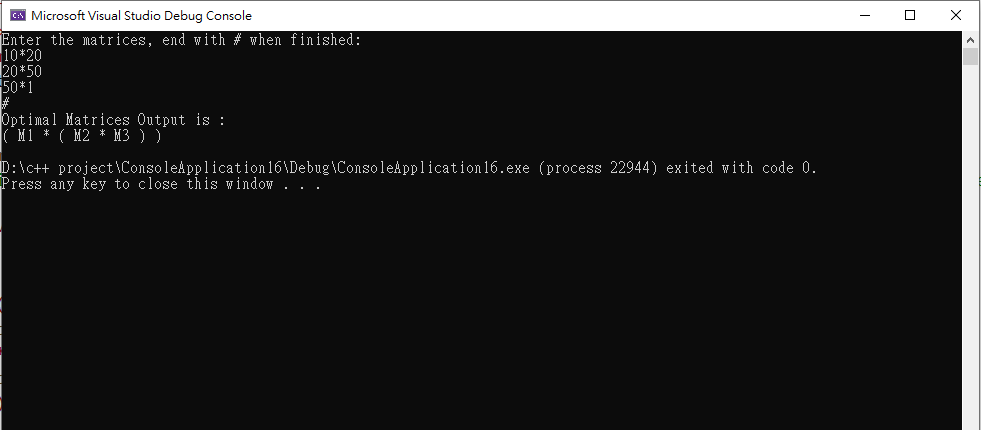

# CS601-Dynamic-Programming-Practice

This program utilize dynamic programming to solve the matrix multiplication problem.

Given a chain of n matrices M1, M2,…, Mn to multiply, rearranging the order of multiplication such that the number of multiplications needed is minimized.

For example:

Matrix A is 10x20

Matrix B is 20x50

Matrix C is 50x1

if we do A x B x C, the number of multiplication needed is (10x20x50)+(10x50x1) = 10500

however, if we do Ax(BxC), the number of multiplication needed becomes (10x20x1) +(20x50x1) = 1200

so the program should output Ax(BxC) instead of (AxB)xC

### Sample input and result

Team member: Yi-Nong Wei, Vijayalaxmi Patil
